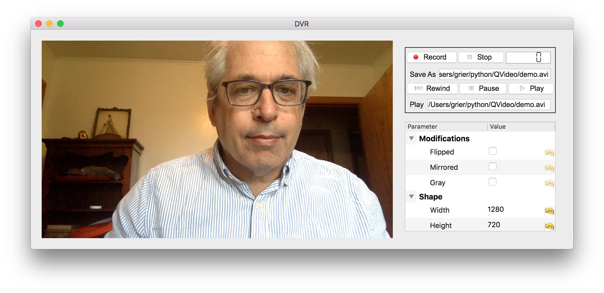

# **QVideo:** PyQt5 support for video cameras

**QVideo** is a framework for integrating
video cameras into PyQt5 projects. 
It simplifies development of hardware interfaces 
that are compatible with Qt and automates developing
widgets that control cameras' properties and operation.
It provides a flexible display widget that can
stream video data while also supporting graphical overlays
and a digital video recorder for saving and playing
AVI and H5 videos.

## Acknowledgements
Work on this project at New York University is supported by
the National Science Foundation of the United States under
award number DMR-2104837.
