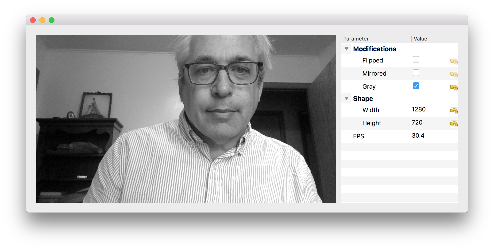

# **QVideo:** PyQt5 support for video cameras

This package provides a unified framework for working with
video cameras under PyQt5. It simplifies development of hardware
interfaces that are compatible with Qt and automates developing
widgets that control cameras' properties and operation.
It also integrates with a flexible display widget that can
stream video data while also supporting video overlays.

## Acknowledgements
Work on this project at New York University is supported by
the National Science Foundation of the United States under
award number DMR-2104837.
