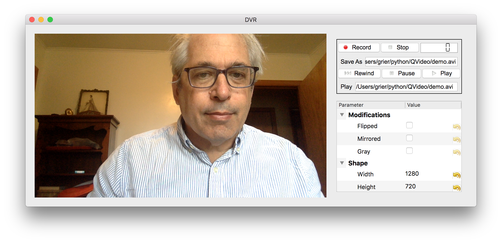

# QVideo: PyQt support for video cameras

[](https://pypi.org/project/QVideo/)
[](https://pypi.org/project/QVideo/)
[](LICENSE.md)
[](https://github.com/davidgrier/QVideo/actions/workflows/test.yml)

**QVideo** is a framework for integrating video cameras into PyQt5 projects
for scientific research.  It provides a unified, registration-based property
system so that every camera backend — USB webcams, GenICam devices, FLIR
cameras, Raspberry Pi cameras — is controlled through the same API.  Property
trees, display widgets, and a digital video recorder are built on top of that
abstraction and require no camera-specific code.



## Features

- **Unified camera API** — `QCamera` subclasses expose adjustable parameters
  via `registerProperty` / `registerMethod`; UI and recording layers consume
  them without knowing the underlying hardware.
- **Auto-built property trees** — `QCameraTree` reads the registered property
  map and builds a `pyqtgraph` parameter tree widget automatically.
- **Threaded video source** — `QVideoSource` wraps any camera in a `QThread`
  and emits `newFrame(ndarray)` at acquisition rate.
- **Composable filter pipeline** — `VideoFilter` / `QFilterBank` sit between
  source and display; filters include blur, edge detection, RGB channel
  selection, sample-and-hold, and statistical median variants.
- **Digital video recorder** — lossless HDF5 (with timestamps) and OpenCV
  video formats; `QDVRWidget` is the composite UI widget.
- **Live display** — `QVideoScreen` supports mouse-aware graphical overlays
  for annotations, regions of interest, and user interaction.

## Installation

```bash
pip install QVideo
```

### Optional hardware backends

| Backend | Extra | Notes |
|---------|-------|-------|
| GenICam cameras (Vimba, etc.) | `pip install QVideo[genicam]` | Requires a vendor-supplied `.cti` producer file |
| Raspberry Pi camera | `pip install QVideo[picamera]` | Requires `picamera2` |
| FLIR / Spinnaker cameras | — | Requires the proprietary PySpin SDK; install that separately |

## Quick start

```python
from pyqtgraph.Qt import QtWidgets
from QVideo.cameras.Noise import QNoiseSource
from QVideo.lib import QVideoScreen

app = QtWidgets.QApplication([])

source = QNoiseSource()          # synthetic noise — no hardware needed
screen = QVideoScreen()
source.newFrame.connect(screen.setFrame)

screen.show()
source.start()
app.exec()
```

Replace `QNoiseSource` with `QOpenCVSource`, `QGenicamSource`, etc. to switch
hardware — the rest of the code is identical.

## Camera backends

| Backend | Class | Hardware |
|---------|-------|----------|
| `cameras/Noise` | `QNoiseCamera` | Synthetic — no hardware required |
| `cameras/OpenCV` | `QOpenCVCamera` | USB webcams via OpenCV |
| `cameras/Genicam` | `QGenicamCamera` | Any GenICam/GigE Vision camera via Harvesters |
| `cameras/Flir` | `QFlirCamera` | FLIR cameras via Spinnaker SDK |
| `cameras/Spinnaker` | `QSpinnakerCamera` | Spinnaker-based cameras |
| `cameras/Picamera` | `QPicamera` | Raspberry Pi camera module |

## Writing a new camera backend

Subclass `QCamera` and implement three methods:

```python
from QVideo.lib import QCamera

class MyCamera(QCamera):

    def _initialize(self) -> bool:
        self.device = open_my_hardware()
        if not self.device:
            return False
        self.registerProperty('exposure',
                              getter=lambda: self.device.get_exposure(),
                              setter=lambda v: self.device.set_exposure(v),
                              ptype=float)
        return True

    def _deinitialize(self) -> None:
        self.device.close()

    def read(self):
        ok, frame = self.device.read_frame()
        return ok, frame
```

`QCameraTree` and `QVideoSource` work with `MyCamera` immediately — no
additional code needed.

## Acknowledgements

Work on this project at New York University is supported by the National
Science Foundation of the United States under award number DMR-2104837 and
by an award from the TAC Program of New York University.
